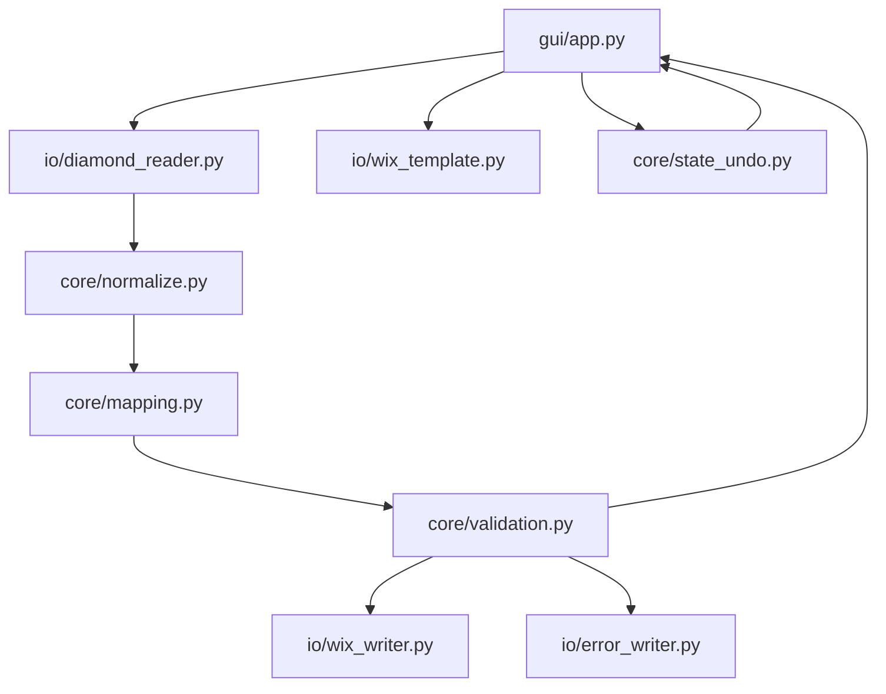

# Windows Python Converter App for DIAMOND SEVEN CSV to Wix Stores CSV

## Executive summary

A small local Windows desktop app is the most practical MVP for your “inventory → online shop” pipeline: it avoids API complexity, fits how Wix already expects bulk product work to happen (CSV import/export), and keeps your parents’ workflow simple (export from inventory software → open converter → review/edit → export Wix CSV → import into Wix). Wix’s CSV import is strict about column names, mandatory fields, and case-sensitive enums (for example `fieldType` must be exactly `PRODUCT`, `VARIANT`, or `MEDIA`).citeturn2view1turn2view0

The recommended stack for the MVP is:

- **Python 3.10+** (Windows)  
- **GUI:** Tkinter + **tksheet** for an Excel-like editable grid (editing + undo are hard with raw `ttk.Treeview`, and PySimpleGUI is a poor choice now due to licensing/operational changes)citeturn1search10turn6search30turn1search21turn1search3  
- **CSV parsing/writing:** Python standard library `csv` (plus `csv.Sniffer` for delimiter detection)citeturn5view0  
- **Encoding detection:** `charset-normalizer` preferred (optionally fallback to `chardet`)citeturn1search0turn1search8turn1search23  
- **Packaging:** PyInstaller to produce a single `.exe` (with known one-file extraction/startup behavior)citeturn0search1turn0search7turn0search10  

You should implement **two modes**:
- **Mode A (MVP):** DIAMOND CSV → **new Wix import CSV** (products only; no images; no variants)  
- **Mode B (later, optional):** DIAMOND CSV + Wix export CSV → **updated Wix CSV** (update price/inventory while preserving Wix’s row structure)

## Requirements, assumptions, and target workflow

### Requirements that directly affect design

Wix requires you to keep the CSV structure intact: do **not** add/delete columns, do **not** rename headers, and fill all mandatory fields in the correct formats.citeturn2view0turn2view1 The import tool also expects a CSV saved in **comma-delimited** format.citeturn2view0turn2view1

Your converter therefore must:
- Read DIAMOND exports that may be semicolon-delimited and encoded with Windows encodings (commonly cp1252 / “windows-1252”).  
- Normalize numeric fields (prices & inventory).
- Output a file that matches the **provided Wix template’s columns exactly**, with Wix-valid values (notably `fieldType`, `name`, `price`, `inventory`).citeturn2view1turn3view0turn3view1

### Assumptions

- The Wix template you attached is treated as the canonical “schema contract” for output. If Wix changes templates in the future, you’ll support it by loading a fresh template header and still mapping into it (as long as the core columns remain). Wix itself notes product creation/import UI changes over time, so treating the template as an external “contract” is the safest approach.citeturn2view0turn2view1  
- MVP does not handle images, variants, categories/collections, or API integration.

### Workflow diagram

```mermaid
flowchart LR
  A[Export CSV from DIAMOND SEVEN] --> B[Open in Converter App]
  B --> C[Auto-parse + normalize + validate]
  C --> D[Review/edit in grid]
  D --> E[Export Wix CSV (UTF-8, comma-delimited)]
  E --> F[Import CSV in Wix Stores Dashboard]
  C --> G[Error CSV + log for failed rows]
```

Wix’s import flow includes downloading the correct template, filling it, and importing it back—your app replaces the error-prone manual “fill it” step.citeturn2view1turn2view0

## Data mapping and validation

### What Wix enforces

From Wix’s official product-import guidance:

- `fieldType` is **mandatory** and must be exactly `PRODUCT`, `VARIANT`, or `MEDIA` (case sensitive).citeturn2view1  
- `name` is mandatory for `PRODUCT` rows and has a max length of **80 characters**.citeturn2view1  
- `visible` must be `TRUE`/`FALSE` (case sensitive); blank defaults to `TRUE`.citeturn2view1turn3view1  
- `price` is mandatory.citeturn3view1turn2view1  
- `inventory` must be `IN_STOCK`, `OUT_OF_STOCK`, or a number; blanks become `OUT_OF_STOCK` (case sensitive for enum values).citeturn3view0  
- `cost` has constraints (no more than 9 digits, no more than 2 decimals).citeturn3view0  
- `sku` max length is 40; variant SKUs should be unique (even though MVP avoids variants, you still want uniqueness).citeturn3view0  

Wix also provides an “error CSV” approach after import; modeling your own “error CSV + reasons” is aligned with Wix’s workflow expectations.citeturn2view1

### What DIAMOND exports look like in your samples

Your attached exports appear in two practical variants:
- A “core” export with the business fields: `Filiale, Kategorie, Warengruppe, Marke, Produktlinie, Artikel Nr, Kurzbeschreibung, Referenz, Menge, Einstand, Verkauf`
- A second export that adds an optional `Bild` column and includes extra empty placeholder columns (multiple semicolons), which you will drop.

This is exactly the kind of “subtly different CSV dialect” problem the Python `csv` module is designed to handle—there is no strict CSV standard, and dialects vary by producing application.citeturn5view0

### Price normalization rules for your Swiss data

You need deterministic numeric parsing because Wix validates `price`/`cost` formats, and because `cost` has explicit digit/precision rules.citeturn3view0turn3view1

Recommended normalization algorithm for `price` and `cost`:

- Trim whitespace
- Remove thousands separators: `'` and `’` (and optionally spaces)
- Decide decimal separator:
  - If string contains both `.` and `,`, treat the **last** occurrence as decimal and remove the other as thousands
  - Else if contains only `,`, treat it as decimal
  - Else use `.` as decimal
- Parse using `Decimal` (not float) to avoid rounding surprises
- Re-format for output as standard `1234.56` (dot decimal), with max 2 decimals for cost and (usually) 2 decimals for price.

### Deliverable table A: DIAMOND → Wix mapping

The table below is a pragmatic MVP mapping designed to satisfy Wix’s mandatory fields and keep edits easy for non-IT users. The “Wix column” names refer to your provided template’s headers; Wix’s help text describes the semantics and constraints.citeturn2view1turn3view0turn3view1

| DIAMOND column | Meaning | Wix column | Mapping / transformation | Validation / notes |
|---|---|---|---|---|
| `Artikel Nr` | Internal item identifier | `handle` | Default: `ds-<Artikel Nr>` (sanitize: lowercase, replace spaces with `-`, remove non-url chars) | A stable handle makes future updates feasible; Wix can auto-generate missing handles, but that makes deterministic matching harder later.citeturn2view1 |
| *(constant)* | Row type | `fieldType` | Always `PRODUCT` (MVP: no variants, no media rows) | Mandatory; case sensitive.citeturn2view1 |
| `Marke`, `Produktlinie`, `Kurzbeschreibung` | Human product name parts | `name` | Default: `"<Marke> <Produktlinie> <Kurzbeschreibung>"` with smart shortening if >80 chars | Mandatory for PRODUCT; max 80 chars.citeturn2view1 |
| *(option)* | Published vs hidden | `visible` | Default `FALSE` (configurable checkbox) | Must be `TRUE`/`FALSE` case sensitive.citeturn2view1 |
| *(optional)* `Warengruppe`, `Referenz`, `Kategorie` | Product description hints | `plainDescription` | Optional: auto-generate a short description like: `Warengruppe: … / Referenz: …` | Max length 16000; safe to leave blank in MVP.citeturn2view1 |
| `Marke` | Brand | `brand` | Copy as-is (trim) | Max length 50.citeturn3view1 |
| `Verkauf` | Selling price | `price` | Normalize to numeric string using Decimal; output with `.` decimal | Mandatory.citeturn3view1turn2view1 |
| `Einstand` | Cost of goods | `cost` | Normalize like price; clamp/validate digits & 2 decimals | Must respect digit/precision constraints.citeturn3view0 |
| `Menge` | Quantity | `inventory` | Option A: numeric inventory (e.g., `1`) Option B: map any positive to `IN_STOCK` (checkbox) | Must be `IN_STOCK`, `OUT_OF_STOCK`, or a number.citeturn3view0 |
| `Artikel Nr` *(or `Referenz`)* | SKU (stock keeping unit) | `sku` | Default: `Artikel Nr` (string) | Max 40; should be unique.citeturn3view0 |
| `Bild` | Image path/flag | `media` | MVP: ignore (leave blank) | Wix media import expects URL or media ID; skip in MVP.citeturn2view1turn3view1 |

## Application architecture and GUI design

### GUI approach that meets “non-IT parents” + editable grid + undo

**Tkinter** is bundled with Python and is intended as a cross-platform GUI toolkit; `tkinter.ttk` provides the native-looking themed widgets.citeturn1search10turn1search2 However, **editable spreadsheet-style grids are not a first-class Tkinter widget**—`ttk.Treeview` can display tabular data, but cell editing and undo require significant custom coding.citeturn6search12turn1search14

To hit your requirements quickly (editable cells + basic undo), use:

- **Tkinter for the windowing**
- **tksheet** for the grid (supports editing and undo features out of the box)citeturn6search30turn6search22

This is strongly preferable over PySimpleGUI right now: PySimpleGUI requires license keys after a trial and announced a planned shutdown/closure timeline, making it a risky dependency for a tool your parents must rely on long-term.citeturn1search21turn1search3

### Screen layout and behaviors

A parent-friendly layout tends to work best in a “wizard-like spreadsheet tool” form:

- Top bar: **Mode selector**
  - “Create Wix import CSV (new products)”
  - “Update existing Wix products (later)”
- File inputs with large buttons:
  - “Open DIAMOND CSV…”
  - “Open Wix template CSV…” (optional; default is bundled template)
- Central grid:
  - Show **DIAMOND fields** + computed **Wix fields** side-by-side
  - Cells editable for Wix-relevant fields (`name`, `price`, `inventory`, `visible`, maybe `brand`)
- Right panel or bottom panel:
  - Validation summary: “Valid: 120 / Errors: 7 / Warnings: 15”
  - Log viewer (scrollable)
- Bottom buttons:
  - “Convert + Validate”
  - “Export Wix CSV”
  - “Export Error CSV”
  - Undo / Redo

### Validation highlighting strategy

Use a 3-level severity model:

- **Error (red row):** will not export to Wix CSV; goes to Error CSV  
  Examples: missing `price`, invalid numeric parse, empty `name` after trimming
- **Warning (yellow row):** exports, but likely needs review  
  Examples: `name` shortened to fit 80 chars, duplicate handle detected and auto-suffixed
- **OK (no highlight/green):** passes rules

The reason this matters: Wix explicitly requires correct formats and mandatory fields, and invalid rows cause import errors.citeturn2view0turn2view1turn3view1

### Module interaction diagram



## Tooling choices and justification

### Recommended stack

**Core recommendation:** Python + Tkinter + tksheet + charset-normalizer + PyInstaller

Justification, tied to your explicit constraints:

- Python is fast for CSV/encoding work and has strong standard library support for dialects (`csv.Sniffer`, `DictReader`, `DictWriter`).citeturn5view0  
- Charset detection is a real problem with Windows-generated CSVs; `charset-normalizer` is designed for turning unknown bytes into correct Unicode text.citeturn1search0turn1search8  
- Wix import is strict; writing with `csv.DictWriter` plus a template header is the most reliable way to ensure you output **exactly** the expected columns and nothing else. The `csv` module explicitly supports dict-based writing and controlling extra fields.citeturn5view0  
- PyInstaller is the most common “single EXE” path for Windows Python apps; one-file mode bundles the interpreter and dependencies into one executable but extracts to a temp directory on startup (known behavior you should account for).citeturn0search1turn0search13turn0search10  

### Deliverable table B: library options with pros/cons

| Component | Recommended | Alternatives | Pros | Cons | Key sources |
|---|---|---|---|---|---|
| CSV parsing/writing | `csv` (stdlib) | `pandas.read_csv` | Full control over delimiter/encoding, small packaged size; Sniffer exists for dialect detectionciteturn5view0 | More manual cleaning than pandas | `csv` docsciteturn5view0 |
| Dialect detection | `csv.Sniffer` | pandas `sep=None` (uses Sniffer) | Explicit support for sniffing delimiter/dialectciteturn5view0 | Heuristic; must restrict candidate delimiters to avoid false detection | `csv.Sniffer` docsciteturn5view0; pandas noteciteturn0search17 |
| Encoding detection | `charset-normalizer` | `chardet` | Built for finding “best usable” decoding for unknown bytes, with API designed for raw bytes inputciteturn1search0turn1search8 | Adds dependency; still possible to mis-detect in rare cases | charset-normalizer docsciteturn1search0turn1search8 |
| Encoding detection (fallback) | *(optional)* `chardet` | — | Standard `detect()` API; modern chardet 7 is faster & more accurate than older versionsciteturn1search20turn1search23 | Another dependency; confidence values can be low on short samples | chardet usage & PyPIciteturn1search20turn1search23 |
| GUI framework | Tkinter | Qt (PySide6) | Tkinter is part of Python and ttk provides native-looking widgetsciteturn1search10turn1search2 | Lacks a native spreadsheet component | Tkinter docsciteturn1search10turn1search2 |
| Editable grid | `tksheet` | custom `ttk.Treeview` editing; Qt `QTableView` | Built for tabular editing + undo; avoids writing a grid editor yourselfciteturn6search22turn6search30 | Extra dependency; you should pin version | tksheet sourcesciteturn6search22turn6search30 |
| GUI alternative | — | PySide6 (`QTableView`) | Strong model/view table; designed for tabular dataciteturn6search0turn6search16 | Heavier packaging; more concepts (models/flags); licensing obligations if distributing broadly | Qt docsciteturn6search0turn6search5turn6search25 |
| GUI to avoid | Avoid PySimpleGUI | — | — | Licensing keys required after trial; project shutdown/closure announcement makes it risky for a “family business tool”citeturn1search21turn1search3turn1search7 | PySimpleGUI docsciteturn1search21turn1search3turn1search7 |
| Packaging | PyInstaller | MSIX, NSIS, Inno Setup | Produces one-folder or one-file executables; one-file bundles into a single EXEciteturn0search4turn0search1 | One-file extracts to temp folder and can start slower; Tk assets extracted toociteturn0search13turn0search10 | PyInstaller docsciteturn0search1turn0search10turn0search7 |
| Installer (optional) | Inno Setup or NSIS | MSIX | Traditional “setup.exe” UX, shortcuts, uninstall; common Windows distribution toolsciteturn4search16turn4search0 | Extra build step; overkill for early MVP | Inno Setup/NSIS docsciteturn4search16turn4search0 |

## Implementation plan, key algorithms, and pseudocode

### Step-by-step implementation plan

A realistic student-friendly task order:

1. **Create a canonical internal model** (list of product records) and a “project state” (loaded DIAMOND file path, parsed rows, edit history).
2. **Implement file import**:
   - Read bytes
   - Detect encoding
   - Detect delimiter/dialect
   - Read header + rows
   - Drop empty columns and optional `Bild`
   - Normalize row dict keys to your canonical DIAMOND schema
3. **Implement normalizers** for text, price/cost, inventory, and “slug/handle” generation.
4. **Implement mapping** from canonical DIAMOND record → Wix row dict with template headers.
5. **Implement validation** against Wix rules (error/warn/ok).
6. **Build GUI MVP**:
   - Open file button(s)
   - Grid view (tksheet)
   - Edit cell commit handler
   - Convert/validate button
   - Export buttons
   - Log area + status bar
7. **Packaging** and “parents usability” polish:
   - “Recent files”
   - “Export succeeded” message
   - Write `log.txt` next to output
8. **Testing** with real exports and deliberate corrupted cases.

### Suggested code structure (modules)

- `gui/app.py`  
  Main window, buttons, grid, status bar, dialog wrappers, event handlers.
- `core/models.py`  
  `ProductRecord`, `ValidationIssue`, `AppState` dataclasses.
- `io/detect.py`  
  `detect_encoding(bytes)`, `detect_dialect(sample_text)`.
- `io/diamond_reader.py`  
  `read_diamond_csv(path) -> list[ProductRecord]`.
- `core/normalize.py`  
  `normalize_text()`, `normalize_price_decimal()`, `normalize_inventory()`, `make_handle()`.
- `core/mapping.py`  
  `diamond_to_wix_row(product, template_header, options) -> dict`.
- `core/validation.py`  
  `validate_wix_row(row) -> issues[]` using Wix constraints.citeturn2view1turn3view0turn3view1  
- `io/wix_template.py`  
  `load_template_header(path) -> list[str]`.
- `io/wix_writer.py`  
  Write comma-delimited UTF-8 Wix CSV ensuring exact headers with `DictWriter`.citeturn5view0turn2view0  
- `io/error_writer.py`  
  Write “error CSV” containing original DIAMOND row + error messages, aligned with Wix’s notion of error CSVs.citeturn2view1  
- `core/state_undo.py`  
  Simple undo stack of “cell edit commands” (row_id, field, old_value, new_value).

### Key functions and pseudocode

#### Encoding detection (robust but simple)

Use `charset-normalizer` as first choice because it’s meant for “unknown bytes → usable Unicode.”citeturn1search8turn1search0

```text
function detect_encoding(file_bytes):
  # fast path
  try decode as 'utf-8-sig' -> return 'utf-8-sig'
  try decode as 'utf-8' -> return 'utf-8'
  try decode as 'cp1252' -> return 'cp1252'

  # robust path
  if charset_normalizer installed:
      result = from_bytes(file_bytes).best()
      if result exists: return result.encoding

  if chardet installed:
      det = chardet.detect(file_bytes)
      if det.confidence >= 0.5: return det.encoding

  # last resort
  return 'latin1'  # never fails, but may produce wrong characters
```

Chardet’s API returns an encoding with a confidence score, and documentation shows typical usage via `detect()`.citeturn1search20turn1search23

#### Delimiter detection and reading

The built-in sniffer can deduce CSV format and returns a dialect, but it’s heuristic; you should constrain delimiters to likely candidates (`; , \t`).citeturn5view0

```text
function detect_dialect(sample_text):
  sniffer = csv.Sniffer()
  try:
     dialect = sniffer.sniff(sample_text, delimiters=";,\t")
     return dialect
  except:
     return default dialect with delimiter=';'
```

Python’s docs define `csv.Sniffer.sniff()` and show the typical “read 1024 bytes, sniff, seek back” pattern.citeturn5view0

#### Parsing DIAMOND exports and normalizing schema

```text
function read_diamond_csv(path):
  bytes = read_all_bytes(path)
  enc = detect_encoding(bytes)
  text = decode(bytes, enc)

  sample = first 4096 chars of text
  dialect = detect_dialect(sample)

  reader = csv.reader(text.splitlines(), dialect=dialect)
  header = next(reader)

  # drop columns whose header is empty or whitespace
  keep_indexes = [i for i,col in enumerate(header) if trim(col) != ""]
  header2 = [trim(header[i]) for i in keep_indexes]

  # optional: drop 'Bild' if present
  if header2[0].casefold() == "bild":
      drop index 0 from keep_indexes and header2

  records = []
  for row in reader:
     row2 = [row[i] if i < len(row) else "" for i in keep_indexes]
     rec = dict(zip(header2, row2))

     # normalize into canonical keys (in case of minor header spelling changes)
     records.append(canonicalize_diamond_record(rec))

  return records
```

If you choose `csv.DictReader`, note that Python documents behavior for rows with more or fewer fields than the fieldnames (extra fields can be captured, missing fields filled).citeturn5view0

#### Normalizing Swiss-style numeric fields

```text
function normalize_price_decimal(s):
  s = trim(s)
  if s == "": return None

  # remove Swiss thousands separators and spaces
  s = replace(s, "’", "")
  s = replace(s, "'", "")
  s = replace(s, " ", "")

  # decimal separator resolution
  if contains(s, ".") and contains(s, ","):
      dec_pos = last_index_of(".", ",")
      dec_char = s[dec_pos]
      other = "," if dec_char == "." else "."
      s = replace(s, other, "")
      s = replace(s, dec_char, ".")
  else if contains(s, ",") and not contains(s, "."):
      s = replace(s, ",", ".")

  d = Decimal(s)  # if fails -> validation error
  return d
```

#### Mapping to Wix template output rows

Wix requires the correct formats for mandatory fields and case-sensitive enums (e.g., `fieldType`, `inventory`, `visible`).citeturn2view1turn3view0turn3view1

```text
function diamond_to_wix_row(diamond, wix_header, options):
  row = {col: "" for col in wix_header}

  row["fieldType"] = "PRODUCT"
  row["handle"] = make_handle(diamond["Artikel Nr"], prefix="ds-")  # or blank if user chooses
  row["visible"] = "FALSE" if options.default_hidden else "TRUE"

  brand = normalize_text(diamond["Marke"])
  line  = normalize_text(diamond["Produktlinie"])
  short = normalize_text(diamond["Kurzbeschreibung"])

  row["brand"] = brand

  # name building with smart shortening to <= 80
  row["name"] = build_wix_name(brand, line, short, max_len=80)

  price = normalize_price_decimal(diamond["Verkauf"])
  row["price"] = format_decimal(price, places=2)  # or no trailing zeros based on preference

  cost = normalize_price_decimal(diamond["Einstand"])
  if cost is not None:
      row["cost"] = format_decimal(cost, places=2)

  qty = parse_int(diamond["Menge"])
  row["inventory"] = qty if options.use_numeric_inventory else ("IN_STOCK" if qty > 0 else "OUT_OF_STOCK")

  row["sku"] = normalize_text(diamond["Artikel Nr"])

  # everything else remains blank in MVP (no media, no variants)
  return row
```

#### Validation rules (MVP subset)

You should implement exactly what Wix documents for the critical fields:

- `fieldType` must be one of the allowed values and is mandatory.citeturn2view1  
- `name` required for `PRODUCT`, blank for others; max 80.citeturn2view1  
- `price` mandatory.citeturn3view1  
- `inventory` must be valid enum or number; blank becomes OUT_OF_STOCK (you should avoid blanks by design).citeturn3view0  

```text
function validate_wix_row(row):
  issues = []

  if row["fieldType"] not in {"PRODUCT"}:
      issues.add(ERROR, "fieldType must be PRODUCT in MVP")

  if row["name"] == "" or len(row["name"]) > 80:
      issues.add(ERROR, "name missing or >80 characters")

  if row["price"] == "":
      issues.add(ERROR, "price missing")

  if not is_inventory_valid(row["inventory"]):
      issues.add(ERROR, "inventory must be IN_STOCK / OUT_OF_STOCK / number")

  if row["visible"] not in {"TRUE","FALSE"}:
      issues.add(ERROR, "visible must be TRUE or FALSE")

  if len(row["sku"]) > 40:
      issues.add(WARN, "sku >40 characters (Wix limit)")

  return issues
```

### Implementing Mode B later (update existing Wix products)

Wix’s “export → edit → import” workflow is designed for updating existing products.citeturn2view0turn0search19 The exported CSV may represent a product across multiple rows: product row plus media rows, and variant rows when options exist.citeturn2view0turn2view1

**Implementation approach:**

1. Load Wix export CSV (comma-delimited) and index by `sku` or `handle`:
   - Prefer `sku` if you guarantee your own SKU uniqueness. Wix recommends uniqueness for variant SKUs.citeturn3view0  
2. Load DIAMOND export and create a lookup `{sku -> (price, inventory, cost)}`.
3. Iterate Wix rows:
   - If `fieldType == PRODUCT` and product has no variants, update `price`, `inventory`, `cost`.
   - If product has variants, update on `VARIANT` rows by SKU (because variants can each have their own inventory). Wix’s column descriptions note that inventory and price can apply at the variant row level.citeturn3view0turn3view1  
4. Export the edited Wix CSV with the same headers and row order.

This “preserve Wix structure, edit only specific fields” strategy prevents accidental corruption of media rows, option definitions, and Wix-managed IDs.

### Implementation checklist to start coding

- Create repo + virtualenv; pin dependencies (`tksheet`, `charset-normalizer`, `pyinstaller`).
- Write `load_template_header()` and unit-test it on the attached template file.
- Write `read_diamond_csv()` with:
  - encoding detection fallback chain
  - Sniffer with delimiters `;,\t`citeturn5view0  
  - drop empty header columns
  - optional drop `Bild`
- Write `normalize_price_decimal()` using `Decimal` and add tests for `1’775.00`, `3550`, `40.85`.
- Write `diamond_to_wix_row()` and `validate_wix_row()`.
- Build GUI skeleton with 3 buttons and a grid; wire “Open DIAMOND” → parse → display.
- Add Convert/Validate: compute wix rows + issues, color rows, populate error panel.
- Export:
  - `wix_import.csv` UTF-8, comma-delimited
  - `error_rows.csv` with reasons
  - `conversion.log` text file
- Only then add undo/redo (tksheet supports undo; otherwise implement a command stack).citeturn6search22turn6search30  

## Testing, packaging, deployment, and future enhancements

### Testing plan and edge cases

You’ll want automated unit tests for normalizers and validators, and a small set of end-to-end sample files.

High-value tests:

- **Encoding**
  - cp1252 umlauts and special quotes; ensure text becomes correct Unicode via detection.citeturn1search8turn1search20  
- **Delimiter**
  - Semicolon-delimited DIAMOND exports
  - Accidental comma-delimited export (ensure Sniffer still works)citeturn5view0  
- **Empty placeholder columns**
  - 15-column header with blank names; confirm your “drop empty header columns” yields canonical schema.
- **Thousands separators**
  - `1’475.00`, `2'950.00`, `3 550.00`, `3,550.00` (last two as robustness tests)
- **Missing mandatory Wix fields**
  - Missing `Verkauf` → price missing → row goes to Error CSV.citeturn3view1  
- **Inventory parsing**
  - Blank quantity → either error or explicit `OUT_OF_STOCK` depending on your design; Wix treats blank inventory as `OUT_OF_STOCK`, but you should be explicit.citeturn3view0  
- **Duplicate `Artikel Nr`**
  - Detect: handles and SKUs may collide; auto-suffix handle (`ds-12345-2`) and warn.
- **Overlong names**
  - Ensure `name` never exceeds 80; either smart-shorten or force user edit with an error.citeturn2view1  
- **Special characters**
  - Include `®` or `™` in name/description; confirm your app can optionally strip them or warn, since Wix notes such characters may display incorrectly after import.citeturn7view0  

### How to present errors to your parents

Make errors actionable and localized to the row:

- In-grid: highlight the entire row
- In a “Problems” panel: show `Row 12 – Missing price (Verkauf)` and a “Jump to row” function
- In `error_rows.csv`: include the original DIAMOND row fields plus columns:
  - `error_codes`
  - `error_messages`

This approach mirrors Wix’s own “Generate Error CSV” concept after import.citeturn2view1

### Packaging and deployment on Windows

#### Building a single EXE with PyInstaller

PyInstaller bundles your script, dependencies, and even the Python interpreter; it can output either a folder-based distribution or (for convenience) a single executable.citeturn0search4turn0search1 The one-file executable extracts its bundled archive into a temp directory at runtime, which makes startup slower and is important to know when you ship it to your parents.citeturn0search13turn0search1

Also note: when packaging Tkinter apps, PyInstaller may extract Tcl/Tk dependencies in one-file mode (normal behavior).citeturn0search10

Minimal packaging steps:

1. Create venv, install dependencies.
2. Run something like:
   - `pyinstaller --onefile --noconsole --name diamond_to_wix gui/app.py`
3. If you bundle the Wix template inside the EXE, use a spec file and include data files; PyInstaller documents spec-file customization and how one-file mode differs from one-folder mode.citeturn0search7  
4. Test on a second Windows machine without Python installed.

#### Optional “real installer” UX

If your parents prefer “install/uninstall + desktop shortcut”:

- **Inno Setup** can create a single distribution setup executable and supports standard Windows wizard UX.citeturn4search16turn4search28  
- **NSIS** is an open-source scriptable installer system designed to be small and flexible.citeturn4search0turn4search3  
- **MSIX** is Microsoft’s modern packaging format, good for managed environments but usually overkill for a family business MVP.citeturn4search1turn4search7  

Mentioning installer tooling once is enough for your MVP; you can start with “copy the EXE into a folder” and add an installer once the workflow is stable.

### Simple user manual text for your parents

**Goal:** Take products from DIAMOND SEVEN → upload them into Wix.

1. In DIAMOND SEVEN, export the products to a CSV file (save it somewhere easy, like Desktop).
2. Run `diamond_to_wix.exe`.
3. Click **Open DIAMOND CSV…** and select the exported file.
4. Review the table:
   - Red rows must be fixed (missing price, invalid quantity, etc.).
   - You can click into cells to edit names and prices.
5. Click **Export Wix CSV**.
6. In the Wix dashboard:
   - Go to Store Products → Import and upload the exported CSV file; Wix’s import flow is documented in their official steps.citeturn2view1turn2view0  
7. If Wix reports errors, download the Wix Error CSV and/or open the converter’s `error_rows.csv` to see what needs fixing.citeturn2view1  

### Deliverable table C: implementation timeline estimate

This assumes you are a student developer working part-time and want a reliable MVP rather than a throwaway script.

| Milestone | Scope | Estimated hours |
|---|---|---:|
| Project setup | Repo, venv, dependency pinning, basic logging | 2–4 |
| Template handling | Load Wix template header; enforce exact output column order | 2–3 |
| DIAMOND reader | Encoding detection + delimiter sniff + schema normalization (11/15 cols) | 6–10 |
| Normalization | Prices (Swiss separators), inventory parsing, text cleanup | 4–6 |
| Mapping + validation | Wix row construction + rules + error reporting | 6–10 |
| GUI MVP | File open, grid display, edit commit, status/log panel | 10–16 |
| Undo/redo | Use tksheet undo or implement simple command stack | 2–6 |
| Export | Wix CSV + error CSV + logs, confirm UTF-8 + comma delim | 3–5 |
| End-to-end testing | Real exports, corrupted files, long names, duplicates | 6–10 |
| Packaging | PyInstaller, testing on clean Windows machine | 2–5 |
| Total MVP | Mode A complete | **43–75** |

Mode B (update existing Wix export CSV) commonly adds another 10–20 hours because you must preserve Wix’s multi-row product representation and handle variants correctly.citeturn2view0turn2view1

### Future enhancements roadmap

- **Images/media support:** Wix expects each media item in its own `MEDIA` row and requires either a media URL or media ID, so you’d need a stable way to host images and reference URLs, or use the API.citeturn2view1turn3view1  
- **Scheduled sync via APIs:** Wix’s Catalog APIs (Catalog V3) support creating/updating products and managing inventory, including inventory items at the variant-location level, and bulk operations.citeturn8search4turn8search1turn8search21  
- **Two-way reconciliation:** store a local mapping file (DIAMOND key ↔ Wix handle/SKU) and generate “diff reports” (added/removed/changed) before applying updates to reduce mistakes.
- **Operational hardening:** signed releases, automatic backup of last exported Wix CSV, and a “dry run” mode that only validates.

